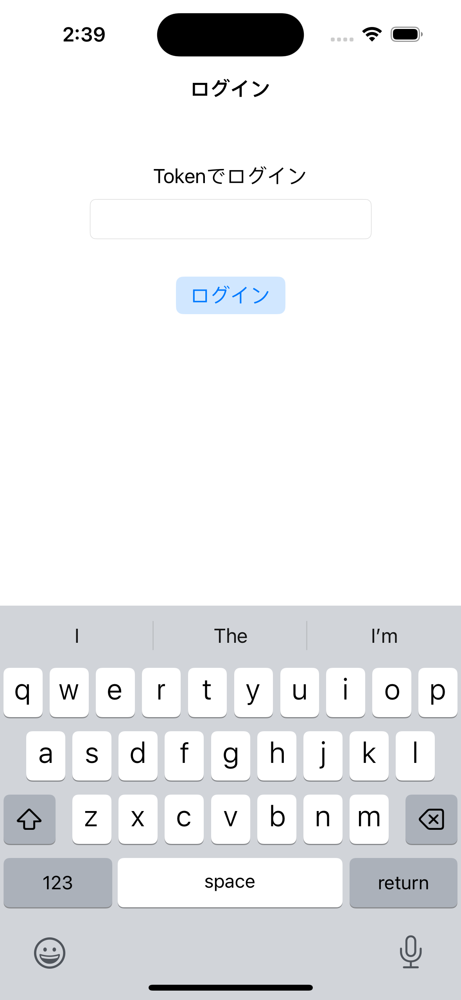
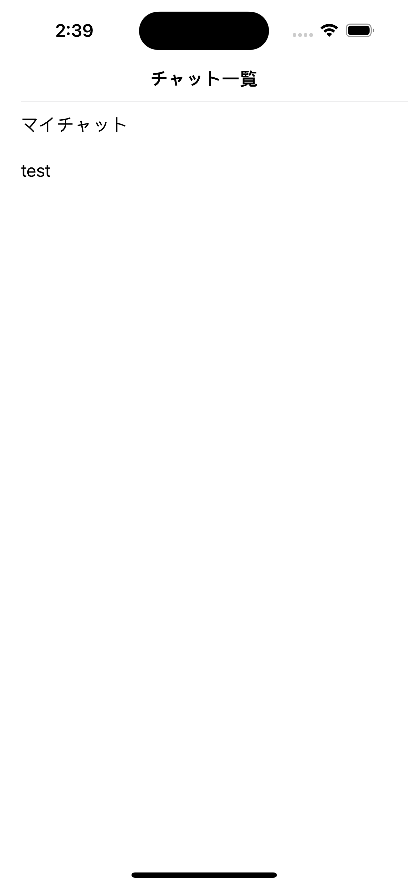
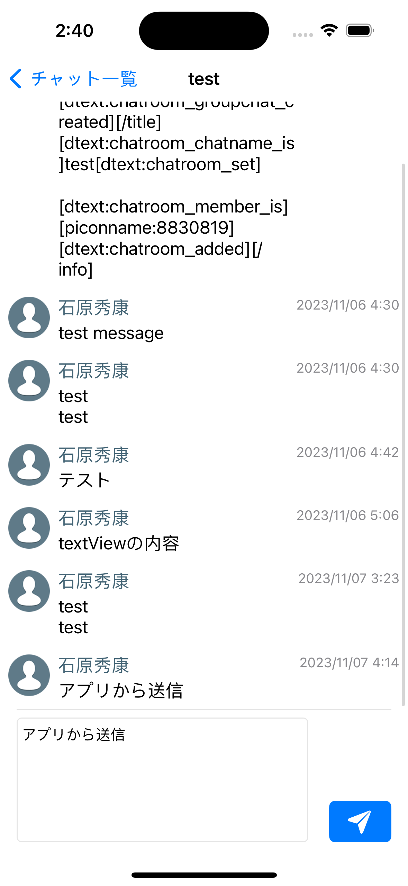

# chatwork-challenge

## 概要

ChatworkAPIを利用したアプリ

## アプリ仕様・動作・説明

本アプリはChatwork APIを利用して、Chatworkに投稿できるアプリです．

| ログイン | チャット一覧 | チャット |
| ------ | ------ | ------ |
|  |   |  |

### ログイン
- アプリを開いた直後の画面
- Tokenを入力し，ボタンをタップすることでログインできる
- ログインに成功するとチャット一覧画面に遷移

### チャット一覧
- チャットルーム一覧を表示
- セルをタップすることで該当するチャットルーム画面に遷移

### チャット
- メッセージ一覧, メッセージ投稿フォームによって構成
- メッセージ一覧: 投稿されたメッセージを一覧表示
    - メッセージ: 投稿者の名前，投稿者のアイコン，メッセージ内容，投稿時間を表示
- メッセージ投稿フォーム: メッセージの内容入力部分, 送信ボタンで構成

### 方針・工夫点
- アーキテクチャは要件通りMVVMを使用
- UIには`UIKit`を使用
    - `SwiftUI`にMVVMは採用すべきではないという議論がある
    - `SwiftUI.View`は`ViewModel`相当の機能が含まれており，`ViewModel`を用意するとかえって冗長で複雑になる？
    - そのため今回は`UIKit`を使用
- レイアウトは主に`StoryBoard`を利用, 1`StoryBoard`-1`ViewController`方式を採用
    - 1つの`StotryBoard`で複数画面を管理するのは複数ブランチでの同時作業をしたい場合に非効率だと考えたため
- チャット画面のレイアウトはLINEやDiscordなどを参考に作成した
    - 今後やりたいこと: 投稿内容を入力した時に文量に応じて`TextView`の高さを変化，一定以上の高さになったら，それ以降はスクロールさせるように
- チャット画面にて，`TextView`に内容が入力されていない場合は投稿ボタンが押せないように
- チャット画面にて，キーボードの開閉に合わせて投稿フォームも上下に移動，`TableView`もスクロールすることで開閉前後で表示されるセルが変わらないように
- ログイン画面にて，ログインに失敗し，エラ文ーが表示された後，再度ログインを試みる場合を考える．この時，ログインボタンを押下した時に一度エラー文を消す．これにより，再度失敗した場合も一度エラー文が消えたことで再試行をしたことがユーザに伝わりやすい．

## セットアップ方法

特になし．

ライブラリは全て`CocoaPods`を用いて導入している．

### 使用ライブラリ

| ライブラリ名 | 用途 |
| ------ | ------ |
| [Moya/Combine](https://github.com/Moya/Moya.git) | ネットワーク通信 |
| [Nuke](https://github.com/kean/Nuke.git) | 画像取得 |
| [Instantiate](https://github.com/tarunon/Instantiate.git) | DI用 |
| [ReusableKit](https://github.com/devxoul/ReusableKit.git) | TableViewCellのregister, dequeue |
| [CombineCocoa](https://github.com/CombineCommunity/CombineCocoa.git) | UIKitのPublisher |
| [KeychainAccess](https://github.com/kishikawakatsumi/KeychainAccess.git) | キーチェーン |
